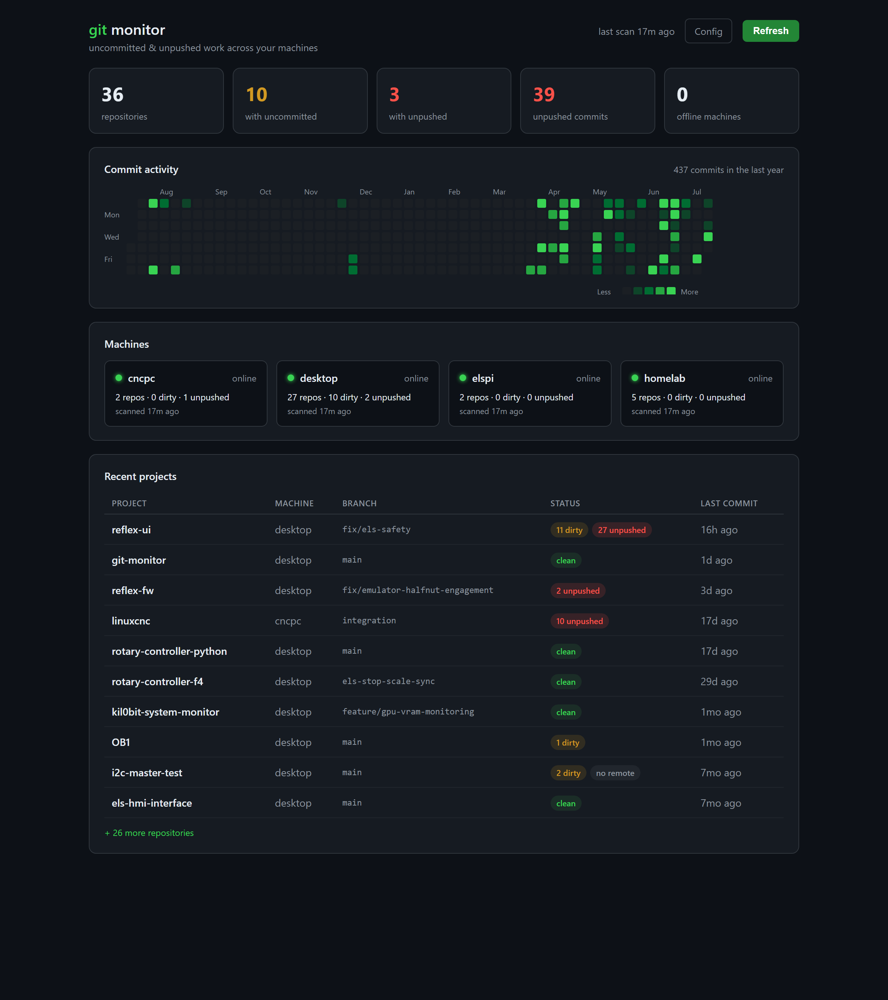

# git-monitor

A small self-hosted dashboard that shows, across all your machines, which git
projects have **uncommitted changes** or **local commits not yet pushed** — plus
a GitHub-style commit **heatmap** and a **recent-projects** list.



It runs one container and pulls status from each machine over SSH (nothing to
install on the machines themselves). Hosts that are offline are flagged and keep
their last-known state.

## How it works

```
config.yaml ──► collector.py ──► scan.py (piped over SSH to each host's python)
                     │                     └─ git plumbing, no network needed
                     ▼
                 data.db (sqlite) ──► app.py (Flask) ──► dashboard + JSON API
```

- **scan.py** — stdlib-only. Walks configured roots for `.git`, and per repo
  collects: dirty-file count, branch, ahead/behind, `unpushed` (commits on HEAD
  not on any remote — works even with no upstream), last-commit time, and a
  per-day commit histogram. Prints JSON. Runs under any Python 3.6+.
- **collector.py** — for each target runs scan.py locally (`ssh: local`) or via
  `ssh host <python> - <b64config> < scan.py`. Unreachable → offline, snapshot kept.
- **storage.py** — sqlite. A successful scan replaces that machine's rows.
- **app.py / render.py** — dashboard (`/`), config editor (`/config`),
  `/api/summary`, `/api/data`, `/api/refresh`. A background thread rescans every
  `scan_interval_minutes`.

## Configuration

Copy the examples and edit for your setup:

```sh
cp config.example.yaml config.yaml
cp compose.example.yaml compose.yaml
```

`config.yaml` and `compose.yaml` are gitignored so your real machine list stays
local. Add/remove machines either:

1. **In the browser** — open `/config` (linked from the dashboard header). A card
   per machine with add/remove, editable scan roots, and a per-host **Test** button
   that SSHes and reports the repo count. An "Advanced: raw YAML" section gives full
   file access. Saves are validated + atomic and trigger a background rescan.
2. **By hand** — edit `config.yaml` (in the container's `/data`). Picked up on the
   next scan — no restart.

Each root takes `path`, `depth` (levels to descend), and `bare: true` for a
directory of bare repos (e.g. `/mnt/git`). A target with `ssh: local` is scanned
on the container itself. Use `extra` for explicit repo paths and `exclude` to skip
large/vendored trees. See [config.example.yaml](config.example.yaml).

(Note: browser saves are written by the container as root, so if you later edit
the file over SSH you may need `sudo`.)

## Requirements on each monitored machine

- `git` and a `python` on PATH (Windows hosts: `python`; set `remote_python: python`).
- An **SSH server** the collector can reach, with the collector's public key in
  `authorized_keys`.
- **Windows hosts:** prefer native **OpenSSH Server** over reaching into WSL — git
  over the WSL `/mnt/c` bridge is dramatically slower (many small file ops cross the
  VM boundary). Native OpenSSH scans `C:/projects` directly on NTFS. Since the user
  is typically a local admin, the collector key goes in
  `%ProgramData%\ssh\administrators_authorized_keys`.

## Deploy

Layout assumes a Dockge-style setup (source in `<apps>/git-monitor/src`, runtime
data in `<apps>/git-monitor/data`), but any Docker host works.

1. Put the source in `<apps>/git-monitor/src` and create `<apps>/git-monitor/data`
   for `config.yaml` + the SSH key (later `data.db`).
2. Generate the collector key and authorize it on each machine:
   ```sh
   ssh-keygen -t ed25519 -N '' -f <apps>/git-monitor/data/id_ed25519
   ssh-copy-id -i <apps>/git-monitor/data/id_ed25519.pub user@<host>   # per machine
   ```
3. Bring up the stack (`docker compose up -d --build`). It serves on host port **8083**.
4. (Optional) Reverse-proxy it behind a hostname with TLS, and restrict access to
   your LAN/VPN.
5. (Optional) A [Homepage](https://gethomepage.dev) tile via the `customapi` widget:
   ```yaml
   - Git Monitor:
       href: http://<host>:8083
       icon: mdi-source-branch-check
       widget:
         type: customapi
         url: http://<host>:8083/api/summary
         mappings:
           - { field: total_repos,      label: Repos }
           - { field: dirty_repos,      label: Dirty }
           - { field: unpushed_commits, label: Unpushed }
   ```

## Local development

```sh
pip install -r requirements.txt
python scan.py --root C:/projects --depth 2 --pretty     # test the scanner
python collector.py --config config.yaml --db data.db --once
GITMON_DB=data.db GITMON_CONFIG=config.yaml python app.py # http://localhost:8083
```

## Notes

- **Root health:** each configured root is checked on every scan. If a root is
  missing or yields no repos (e.g. an unmounted NFS share), the machine card
  shows a warning instead of silently reporting fewer repos.
- **Unreadable repos:** if `git` refuses a repo the scanner found, its message is
  kept and shown (an `unreadable` badge on the row, a count on the machine card).
  The common case is *"detected dubious ownership"* — you SSH in as a different
  user than the one that owns the checkout, and every field comes back null. Fix
  with `git config --global --add safe.directory <path>` on that host.
- **Copies of the same project.** The same repo often lives in several places at
  once — a checkout on your desktop, another on the box that actually runs it,
  and a bare mirror acting as the local remote. Those are grouped into one card
  showing which copy is newest and how far behind each other one is.

  This is computed *between machines*, not from `git fetch`. The built-in
  `behind` count compares against the local remote-tracking ref, which is only
  as fresh as that machine's last fetch — so the case that matters most (you
  push from your desktop, the server copy silently goes stale) reports
  `behind=0`. Instead each copy reports its branch tips plus a capped ordered
  history (`scan.py`), and [replicas.py](replicas.py) locates one copy's tip
  inside another's history: the index *is* the number of commits behind. No
  fetching, no network, and it still works when a machine can't reach the remote
  at all.

  Copies are matched on root-commit SHA **and** project name. Root SHA alone
  over-groups: a project started by branching off another keeps the original
  root commit forever, so `reflex-ui` and the `rotary-controller-python` it grew
  out of look identical by that measure.
- The heatmap aggregates commits across all repos/machines. A repo checked out
  on two machines can double-count shared history; acceptable for a personal view.
- `unpushed` is the reliable "at-risk work" signal; `ahead`/`behind` need a
  configured upstream and are shown as extra detail when available.
