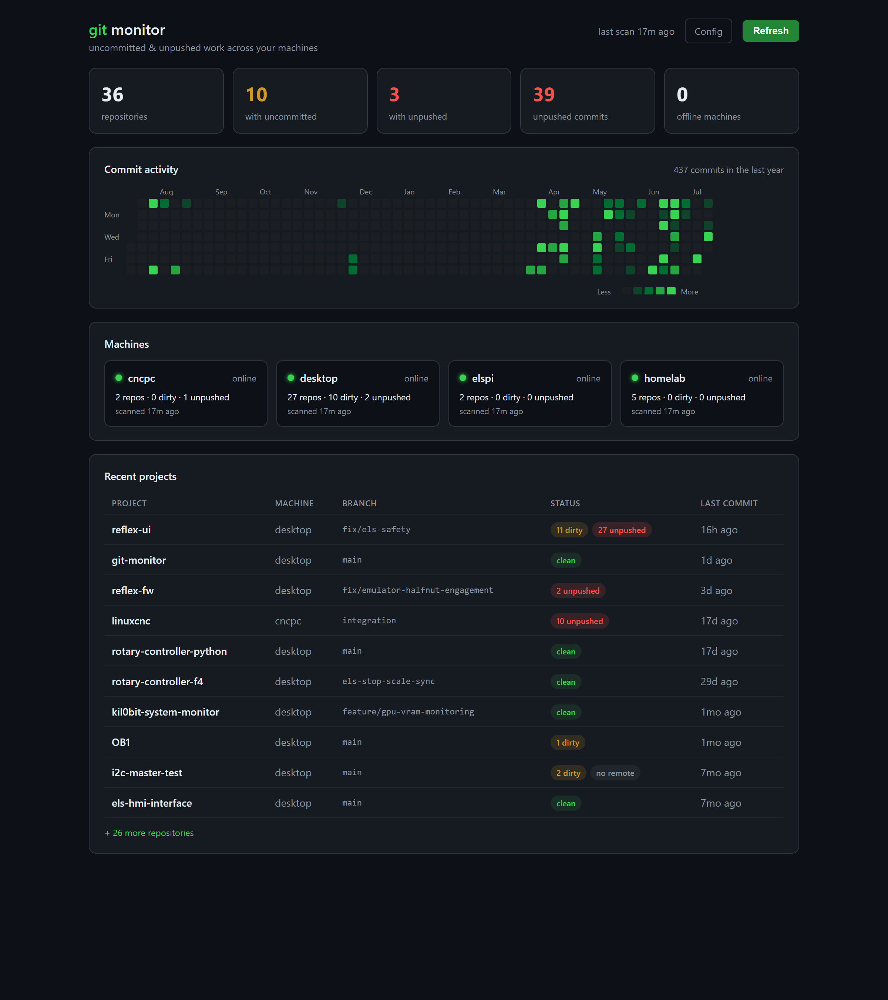

# git-monitor

A small self-hosted dashboard that shows, across all your machines, which git
projects have **uncommitted changes** or **local commits not yet pushed** — plus
a GitHub-style commit **heatmap** and a **recent-projects** list.



It runs one container and pulls status from each machine over SSH (nothing to
install on the machines themselves). Hosts that are offline are flagged and keep
their last-known state.

## How it works

```
config.yaml ──► collector.py ──► scan.py (piped over SSH to each host's python)
                     │                     └─ git plumbing, no network needed
                     ▼
                 data.db (sqlite) ──► app.py (Flask) ──► dashboard + JSON API
```

- **scan.py** — stdlib-only. Walks configured roots for `.git`, and per repo
  collects: dirty-file count, branch, ahead/behind, `unpushed` (commits on HEAD
  not on any remote — works even with no upstream), last-commit time, and a
  per-day commit histogram. Prints JSON. Runs under any Python 3.6+.
- **collector.py** — for each target runs scan.py locally (`ssh: local`) or via
  `ssh host <python> - <b64config> < scan.py`. Set `remote_script: installed` for
  a host whose sshd always execs its own copy of scan.py and never reads stdin
  (piping into one hangs the ssh session until timeout). Unreachable → offline
  after 2 consecutive failed scans (one blip stays online), snapshot kept.
- **uptime.py** — per-target `expected_online` windows. A machine that is
  deliberately off overnight is not a fault: outside its window an unreachable
  target is not debounced, not counted offline and not reported as a failed
  scan, and the dashboard shows it as `off-hours`. See [Configuration](#configuration).
- **storage.py** — sqlite. A successful scan replaces that machine's rows; a
  failed one keeps them, so every machine also carries the age of its own
  snapshot (`stale`, `snapshot_age_days`) to stop old data reading as current.
- **signals.py** — the registry of everything the dashboard can say about a
  repo (dirty, unpushed, stashes, untracked, precious files, worktrees, no
  remote, unreadable, bare). Each is declared once and every other stage
  iterates it: storage builds its columns and its INSERT from it, projects.py
  carries it, render.py chips it and rolls it up onto a collapsed row. Adding a
  signal means adding it here and nowhere else — read the module docstring
  before adding one anywhere else.
- **app.py / render.py** — dashboard (`/`), config editor (`/config`),
  `/api/summary`, `/api/data`, `/api/refresh`. A background thread rescans every
  `scan_interval_minutes`.

## Configuration

Copy the examples and edit for your setup:

```sh
cp config.example.yaml config.yaml
cp compose.example.yaml compose.yaml
```

`config.yaml` and `compose.yaml` are gitignored so your real machine list stays
local. Add/remove machines either:

1. **In the browser** — open `/config` (linked from the dashboard header). A card
   per machine with add/remove, editable scan roots, and a per-host **Test** button
   that SSHes and reports the repo count. An "Advanced: raw YAML" section gives full
   file access. Saves are validated + atomic and trigger a background rescan.
2. **By hand** — edit `config.yaml` (in the container's `/data`). Picked up on the
   next scan — no restart.

Each root takes `path`, `depth` (levels to descend), and `bare: true` for a
directory of bare repos (e.g. `/mnt/git`). A target with `ssh: local` is scanned
on the container itself. Use `extra` for explicit repo paths and `exclude` to skip
large/vendored trees. See [config.example.yaml](config.example.yaml).

(Note: browser saves are written by the container as root, so if you later edit
the file over SSH you may need `sudo`.)

### Repos a machine is supposed to have

`roots` says where to look. It cannot say what has to come back, and an absent
repo is the one thing every check here is otherwise blind to: a repo that falls
out of scope -- a moved path, a `depth` set one level too shallow, a root that
quietly stopped matching -- produces no rows, and no rows is exactly what a
machine with nothing to report looks like too. On 2026-08-17 a Pi's only root
was `{path: /, depth: 1}`, so a repo three levels down had never once been
scanned; the dashboard reported the machine's other repo as having unpushed
work and said nothing whatsoever about that one, which read as "it is fine".

Declare what a machine must be carrying:

```yaml
  - name: pi
    roots:
      - { path: /, depth: 1 }
    expected_repos:          # repo directory basenames, case-insensitive
      - reflex-ui
      - reflex-fw
```

Anything declared and not found is reported per machine as
`missing:<repo> -- declared in expected_repos, not found by this scan`, on the
machine card, in `/api/data` under `missing_repos`, and in that machine's
`root_warnings` list -- the last so existing consumers that already alert on
root warnings pick it up with no change.

Omit the key to declare nothing; that is the default, and it is the honest one
for a machine whose inventory you have not actually written down. An OFFLINE or
off-hours machine never produces these: being unreachable already explains the
absence, and alarming there would mean one false alarm per declared repo per
cycle on every host that is merely powered off.

### Machines that are off part of the day

The 2-failure debounce guards against a *blip*. A workstation that is powered
off every night fails every scan in a row and trips it on the second one, so it
reported `OFFLINE` every night — permanently red, and therefore worth nothing.
Give such a target the hours it is expected to be up:

```yaml
timezone: America/New_York        # file-level default; no guessing, see below

targets:
  - name: desktop
    ssh: user@192.168.1.20
    expected_online: "07:00-23:00"          # shorthand: hours, every day
    # expected_online:                      # or the full form
    #   hours: "07:00-23:00"                # end EXCLUSIVE; may cross midnight
    #   days: [mon, tue, wed, thu, fri]     # optional; default every day
    #   timezone: Europe/Berlin             # optional; overrides the default
```

Outside the window, a failure to reach the target is recorded (error and
timestamp, as always) but not *judged*: no `fail_streak`, no `reachable`
change, not counted in `offline_machines`, and `ok: true` in
`last_scan.results`. The scan is still attempted, so a machine that happens to
be up at 02:00 is picked up anyway. **The trade, accepted deliberately: a
genuinely dead machine goes unreported until its window opens.**

`timezone` has no default — the collector container's clock is UTC while the
hours you write are wall-clock hours, and guessing would shift every window by
the UTC offset while still looking like a working feature. A window that cannot
be parsed (or names a zone with no database behind it) is ignored, everything
alerts exactly as it would with no window at all, and the machine card says so;
a save through `/config` refuses it outright. Timezone data comes from the
`tzdata` package in requirements.txt, since neither python:slim nor Python on
Windows ships one.

### Data that has stopped arriving

A host that cannot be reached keeps its last snapshot — deliberately, so a blip
does not blank the dashboard. The cost is that its repos keep being drawn as
though they had been observed just now, and nothing on the page distinguishes
*this is how that machine looks* from *this is how that machine looked a
fortnight ago*. `offline_machines` does not cover it: by design that counter
ignores a machine outside its `expected_online` window, so the very host most
likely to be unplugged for weeks — a workstation, off overnight, read by a
consumer that runs at 01:07 — is the one it can never report. That is not
hypothetical; a desktop sat about two weeks off wired ethernet in Aug 2026 and
every nightly digest quoted its git state as current fact.

Every machine therefore carries the age of its own snapshot, measured against
the clock and nothing else:

```yaml
stale_after_days: 3        # top-level; default 3
```

Past that, `/api/data` reports `stale: true` and `snapshot_age_days` on the
machine record, `stale_machines` counts it in the summary, and the machine card
prints `⚠ stale -- last successful scan 4.2 days ago`. Three days is chosen to
clear the longest ordinary silence (a weekend, a holiday Monday, a trip) while
still catching a real absence inside the first week.

**Stale and offline are independent.** An off-hours machine is behaving exactly
as declared *and* its data can still be a week old; those are two different
sentences, and staleness is gated on neither `reachable` nor `off_hours` —
gating it on either would rebuild the blind spot it exists to close. A machine
that has never been scanned successfully is stale with `snapshot_age_days:
null` and `stale_reason: never` (absent data is not old data); an unreadable
timestamp is `stale_reason: unreadable`, stale with an unknown age rather than
silently fresh. Nothing is hidden — the snapshot is still the best information
there is about that host, and the defect was only ever that it was unlabelled.

## Requirements on each monitored machine

- `git` and a `python` on PATH (Windows hosts: `python`; set `remote_python: python`).
- An **SSH server** the collector can reach, with the collector's public key in
  `authorized_keys`.
- **Windows hosts:** prefer native **OpenSSH Server** over reaching into WSL — git
  over the WSL `/mnt/c` bridge is dramatically slower (many small file ops cross the
  VM boundary). Native OpenSSH scans `C:/projects` directly on NTFS. Since the user
  is typically a local admin, the collector key goes in
  `%ProgramData%\ssh\administrators_authorized_keys`.

## Deploy

Layout assumes a Dockge-style setup (source in `<apps>/git-monitor/src`, runtime
data in `<apps>/git-monitor/data`), but any Docker host works.

1. Put the source in `<apps>/git-monitor/src` and create `<apps>/git-monitor/data`
   for `config.yaml` + the SSH key (later `data.db`).
2. Generate the collector key and authorize it on each machine:
   ```sh
   ssh-keygen -t ed25519 -N '' -f <apps>/git-monitor/data/id_ed25519
   ssh-copy-id -i <apps>/git-monitor/data/id_ed25519.pub user@<host>   # per machine
   ```
3. Bring up the stack (`docker compose up -d --build`). It serves on host port **8083**.
4. (Optional) Reverse-proxy it behind a hostname with TLS, and restrict access to
   your LAN/VPN.
5. (Optional) A [Homepage](https://gethomepage.dev) tile via the `customapi` widget:
   ```yaml
   - Git Monitor:
       href: http://<host>:8083
       icon: mdi-source-branch-check
       widget:
         type: customapi
         url: http://<host>:8083/api/summary
         mappings:
           - { field: total_repos,      label: Repos }
           - { field: dirty_repos,      label: Dirty }
           - { field: unpushed_commits, label: Unpushed }
   ```

## Local development

```sh
pip install -r requirements.txt
python scan.py --root C:/projects --depth 2 --pretty     # test the scanner
python collector.py --config config.yaml --db data.db --once
GITMON_DB=data.db GITMON_CONFIG=config.yaml python app.py # http://localhost:8083
python -m unittest discover -s tests                     # stdlib only, no deps
```

The tests walk every registered signal (see `signals.py`) through the whole
pipeline — scan field, DB column, project view, chip, and the roll-up onto a
collapsed project row — and fail if any stage drops it. Run them after touching
anything a repo reports about itself.

## Notes

- **Root health:** each configured root is checked on every scan. If a root is
  missing or yields no repos (e.g. an unmounted NFS share), the machine card
  shows a warning instead of silently reporting fewer repos.
- **Unreadable repos:** if `git` refuses a repo the scanner found, its message is
  kept and shown (an `unreadable` badge on the row, a count on the machine card).
  The common case is *"detected dubious ownership"* — you SSH in as a different
  user than the one that owns the checkout, and every field comes back null. Fix
  with `git config --global --add safe.directory <path>` on that host.
- **The unit is a project, not a checkout.** The same repo often lives in
  several places at once — a checkout on your desktop, another on the box that
  runs it, and a bare mirror acting as the local remote — but one logical change
  touches all of them. So the list shows **one row per project** (surfacing the
  most-recently-touched copy) that expands into a **Project → Branch → Instance**
  tree, built in [projects.py](projects.py). It degenerates gracefully: a
  single-instance repo is a plain row; many copies on one branch expand straight
  to instances; many branches expand to branches (the newest pre-opened) that in
  turn open to instances. A branch earns a row only if it's checked out
  somewhere or the copies disagree on it, so quiet shared branches don't bury the
  one you're on. Nothing past the top row shows until you click, so the default
  view stays above the fold.

  Cross-copy state is computed *between machines*, not from `git fetch`. The
  built-in `behind` count compares against the local remote-tracking ref, which
  is only as fresh as that machine's last fetch — so the case that matters most
  (you push from your desktop, the server copy silently goes stale) reports
  `behind=0`. Instead each copy reports its branch tips plus a capped ordered
  history (`scan.py`), and `projects.py` locates one copy's tip inside another's
  history: the index *is* the number of commits behind. No fetching, no network,
  and it still works when a machine can't reach the remote at all.

  Copies are matched by **union-find over several identity keys** — two
  instances group if they share *any* of: a normalized `origin` URL (the same
  hosted repo groups across differing directory names — cncpc's `~/linuxcnc`
  *is* `fj-lcnc-cfg`), a local origin's path-tail (a checkout to the bare it
  clones from), or a **root commit + name** (plain clones and their bare mirror).
  Only `origin` contributes a hosting key, so an `upstream` fork remote doesn't
  fuse every fork together; and the name guards a shared root, so a project that
  merely branched off another (`esp32_air_dryer_controller` off the valve
  controller, `reflex-ui` off `rotary-controller-python`) stays its own project.
- **Backup marker.** Each project carries a neutral label — `GitHub`, `local`
  (only a bare mirror / non-hosting remote), `GitHub+local`, or `no remote` —
  so it's visible at a glance which projects are pushed to a hosting service
  versus living only on the NAS. It's a marker, not a nag: local-only is a
  legitimate choice. For a repo backed up both places, the tooltip notes any
  commits committed locally but not yet pushed to the hosting remote.
- The heatmap aggregates commits across all repos/machines. A repo checked out
  on two machines can double-count shared history; acceptable for a personal view.
- `unpushed` is the reliable "at-risk work" signal; `ahead`/`behind` need a
  configured upstream and are shown as extra detail when available.
